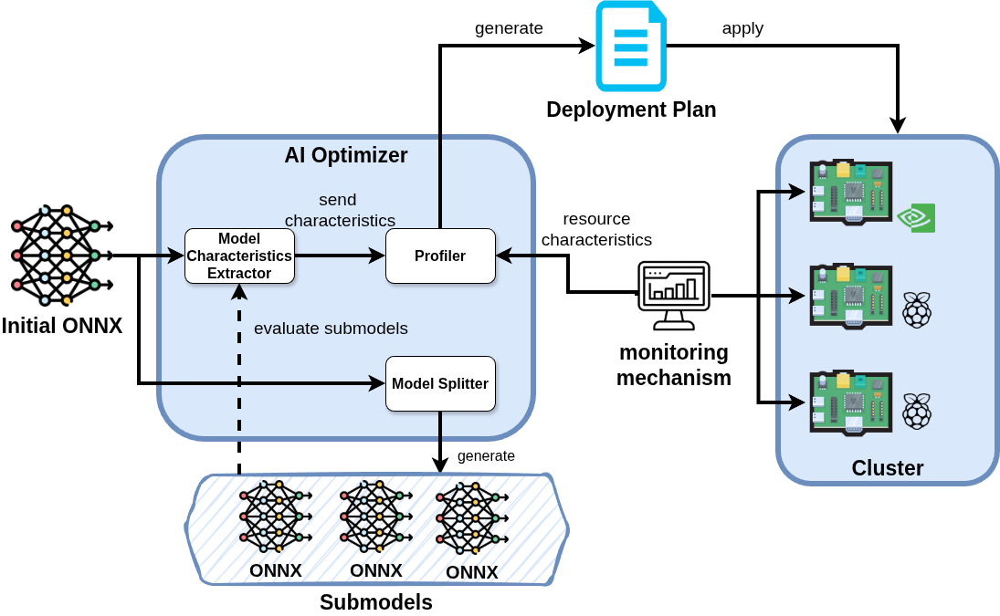

# PEPPER: Profiling-based Edge Placement and Partitioning for
 
This repository provides the code for a pipeline
is for profiling and partitioning ONNX models, to enhance
inference efficiency across heterogeneous hardware platforms. Optimal split points within the deep learning models are identified
through the application of Tarjan’s Bridge-Finding Algorithm, and
the inference times of the models are predicted per device based on
the respective characteristics and CPU load. For the prediction of
inference times, the XGBoost algorithm is employed. The effectiveness of the proposed approach is validated through experiments
conducted on real-world edge devices, demonstrating that highly efficient and adaptable deployment of complex deep learning models
can be achieved in such environments.


## Architecture



### Components

1. [Model Extractor Characteristics](/model_characteristics_extractor/README.md)
2. [Profiler](/profiler/README.md)
3. Model Splitter (to be added)
4. [EdgeCloud Mon as monitoring mechanism](https://github.com/Efficient-Computing-Lab/EdgeCloud-Mon)

## Cite Us
If you use the above code for your research, please cite our paper:

- [PEPPER: Profiling-based Edge Placement and Partitioning for Deep Learning Execution](https://dl.acm.org/doi/10.1145/3770501.3770528)
```
@inproceedings{10.1145/3770501.3770528,
author = {Korontanis, Ioannis and Kontopoulos, Ioannis and Zacharia, Athina and Makris, Antonios and Chronis, Christos and Pateraki, Maria and Tserpes, Konstantinos and Varlamis, Iraklis},
title = {PEPPER: Profiling-based Edge Placement and Partitioning for Deep Learning Execution},
year = {2025},
isbn = {9798400715952},
publisher = {Association for Computing Machinery},
address = {New York, NY, USA},
url = {https://doi.org/10.1145/3770501.3770528},
doi = {10.1145/3770501.3770528},
abstract = {Unlocking the full potential of AI at the edge requires overcoming the fundamental challenge of running complex models efficiently on devices with limited computational power. In this work, the challenge of optimizing the deployment of deep learning models in resource-constrained environments is addressed. A novel pipeline is proposed for profiling and partitioning ONNX models, to enhance inference efficiency across heterogeneous hardware platforms. Optimal split points within the deep learning models are identified through the application of Tarjan’s Bridge-Finding Algorithm, and the inference times of the models are predicted per device based on the respective characteristics and CPU load. For the prediction of inference times, the XGBoost algorithm is employed. The effectiveness of the proposed approach is validated through experiments conducted on real-world edge devices, demonstrating that highly efficient and adaptable deployment of complex deep learning models can be achieved in such environments.},
booktitle = {Proceedings of the 15th International Conference on the Internet of Things},
pages = {228–236},
numpages = {9},
keywords = {Profiling, Distributed Inference, Edge, Placement, IoT},
location = {},
series = {IOT '25}
}
```