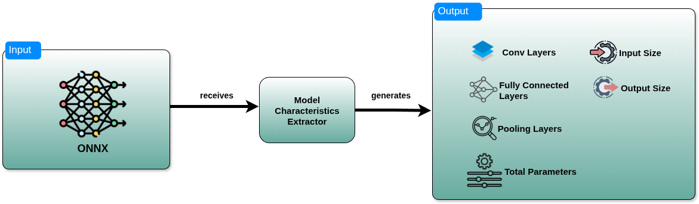

# Model Characteristics Extractor
The Model Characteristics Extractor is responsible for extracting model/submodel specifications.





## Web Service
To use the Model Characteristics Extractor it is suggested to run its container version
by doing the following steps:

### Build the Docker image
The following command builds the image and stores it in Dockerhub
```bash 
docker buildx build --platform linux/amd64 -t gkorod/model_characteristics_extractor:v1.0 --push --no-cache
```
### Run Docker Container
The following command initiates the Model Characteristics Extractor inside a Docker container.
Model Characteristics Extractor requires to know the Profiler endpoint in order provide the
answer of the profiling upon request.

```bash
docker run -d -t -p 7002:7002 -e PROFILING_SERVICE_URL=147.102.19.159:7001/api/profiling gkorod/model_characteristics_extractor:v1.0
```
### Send Request
Model Characteristics Extractor expects this kind of input:
```bash 
curl -X POST http://147.102.19.159:7002/upload \
  -F "file=@crf12345AndLab123MI3_640.onnx" \
  -F "model_input_size=12345" \
  -F "model_output_size=67890"
```
In the above command the `model_input_size` parameter is the size of the image expected in bytes.
The `model_output_size` parameter is the expected output of the model in bytes. 