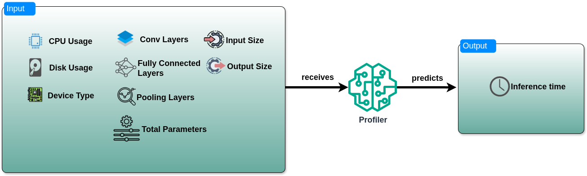

# Profiler
The Profiler takes as input the model(s) specifications and the resource characteristics of the cluster (e.g., CPU current load, disk usage, and device type) that consists of a varying number of edge devices. 
Finally, the Profiler predicts in which device of the cluster the model will run faster and places the model(s) in that device.




Two Docker image versions of the Profiler have been released. The first integrates with a Prometheus monitoring stack: when the Profiler 
is provided with model characteristics, it queries Prometheus to retrieve resource metrics and device information, 
then predicts the fastest device in a K3s cluster by combining these metrics with the model details. 
The second is a standalone version that expects all necessary data, including monitoring metrics, 
as input and then predicts the corresponding inference time.


### Web Service
To use the Profiler it is suggested to run its container version
by doing the following steps:

#### Build the Docker image locally
The following command builds the image and stores it in your local machine

```bash 
docker build --platform linux/amd64 -t profiler:v1.0 .
```
#### Build the Docker image and push to Github Container Registry
The following command builds the image and stores it in Dockerhub

```bash 
docker buildx build --platform linux/amd64 -t ghcr.io/soprano-project/profiler:v1.0 --push --no-cache .
```
#### Run Docker Container
The following command initiates the Profiler inside a Docker container.
Profiler requires to interact with a Prometheus endpoint in order to retrieve metrics and resource characteristics
regarding the devices of the cluster.

The Prometheus monitoring mechanism 
should use [Node Exporter](https://github.com/prometheus/node_exporter) 
and [Characterization-Agent v1.2](https://github.com/Efficient-Computing-Lab/EdgeCloud-Mon/tree/main/char_agent)

During the development, we tested profiler with this [monitoring stack](https://github.com/Efficient-Computing-Lab/EdgeCloud-Mon/) that is able to monitor
every node of a Kubernetes cluster. Developers can should install the aboved mentioned monitoring stack or any Prometheus based monitoring stack 
that use the above-mentioned agents before installing this version of the Profiler.
```bash
docker run -d -t -p 7001:7001 -e PROMETHEUS_IP=<PROMETHEUS-IP> ghcr.io/soprano-project/profiler:v1.0
```
### Send Request
Profiler container expects this kind of input:
```bash 
curl --location 'http://<PROFILER-IP>:7001/api/profiling' \
--header 'Content-Type: application/json' \
--data '{       "model" : "model",
        "conv_layers" : 66666666,
        "pool_layers" : 77777777,
        "fc_layers" : 34535353535,
        "filter_details" : 66,
        "total_parameters" : 10000000000000000000,
        "model_input_size": 345343543,
        "model_output_size": 123421435}'
```

#### Response
Profiler container will provide the prediction of the device that will run faster the model
```json
{
  "message": "Profiling data received",
  "model_characteristics": {
    "conv_layers": 66666666,
    "fc_layers": 34535353535,
    "filter_details": 66,
    "model": "model",
    "model_input_size": 345343543,
    "model_output_size": 123421435,
    "pool_layers": 77777777,
    "total_parameters": 10000000000000000000
  },
  "profiling_prediction": {
    "class": "Computer",
    "device_model": "Raspberry Pi 4B",
    "model": "model",
    "node": "rpi-1",
    "node_uuid": "4e849968-21fc-11ed-a346-204ef6b52cc7",
    "predicted_execution_time": 14.74413776397705
  },
  "status": "success"
}

```

## Standalone Prediction
It is recommended not to build this version from source, as the source code is not included in this repository. 
This version is intended only for minimal environments to test model usage. The following instructions explain how to deploy and run it as a container.

#### Run Docker Container
The following command initiates the Profiler inside a Docker container.

```bash
docker run -d -t -p 7001:7001 ghcr.io/soprano-project/profiler:trial
```
### Send Request
Profiler container expects this kind of input:
```bash 
curl --location 'http://<PROFILER-IP>/api/profiling' --header 'Content-Type: application/json' --data '{       "model" : "model",
        "conv_layers" : 66666666,
        "pool_layers" : 77777777,
        "fc_layers" : 34535353535,
        "filter_details" : 66,
        "total_parameters" : 10000000000000000000,
        "model_input_size": 345343543,
        "cpu_usage(percentage)": 95,
        "disk_usage(percentage)":75,
        "device_type": "Raspberry Pi 4B",
        "model_output_size": 123421435}'
```

#### Response
Profiler container will provide the prediction of the device that will run faster the model
```json
{
  "message": "Profiling data received",
  "model_characteristics": {
    "conv_layers": 66666666,
    "cpu_usage(percentage)": 95,
    "device_type": "Raspberry Pi 4B",
    "disk_usage(percentage)": 75,
    "fc_layers": 34535353535,
    "filter_details": 66,
    "model": "model",
    "model_input_size": 345343543,
    "model_output_size": 123421435,
    "pool_layers": 77777777,
    "total_parameters": 10000000000000000000
  },
  "profiling_prediction": {
    "model": "model",
    "predicted_execution_time": 21.785417556762695
  },
  "status": "success"
}


```